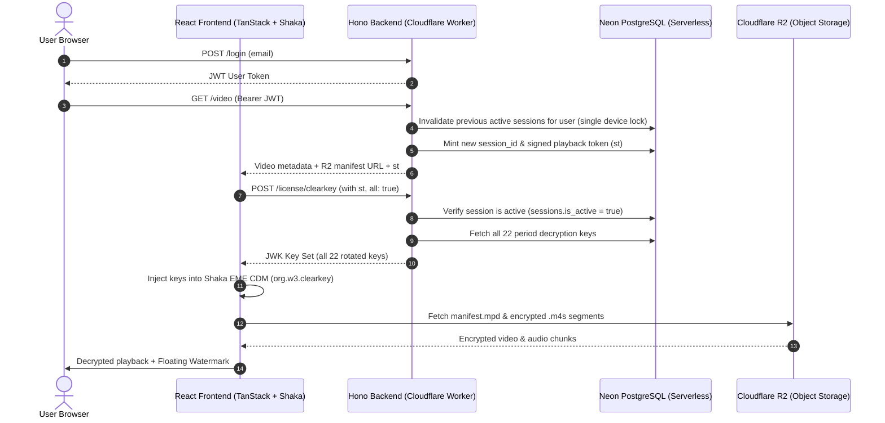

# Hardened Encrypted Video Streaming & DRM Pipeline

A complete end-to-end DRM video streaming system implementing **MPEG-DASH**, **ISO Common Encryption (CENC AES-128 CTR)**, and the **W3C Clear Key EME standard** with **multi-period dynamic key rotation**, **single-device concurrency enforcement**, and **tamper-evident session watermarking**.

---

## Architecture Overview



---

## Core Technologies & How They Work

### 1. Content Encryption: CENC (ISO/IEC 23001-7)
- **Algorithm:** AES-128 in **Counter (CTR)** mode (`cenc`).
- **Mechanism:** Unlike full-file encryption (which corrupts container headers like `moov`, `trak`, and `sidx`), CENC selectively encrypts only the **raw media sample payloads** (NAL units). Container headers remain unencrypted so players can demux timing, framerate, and resolution without decrypting the payload.
- **PSSH (Protection System Specific Header):** Embedded in MP4 headers and the DASH manifest. Declares the DRM system UUID (`1077efec-c0b2-4d02-ace3-3c1e52e2fb4b` for W3C Clear Key) and Key IDs (KIDs).

### 2. Browser DRM: W3C Clear Key (`org.w3.clearkey`)
- **Encrypted Media Extensions (EME):** Standard W3C HTML5 API supported natively across Chromium (Chrome, Edge, Brave) and Firefox.
- **Content Decryption Module (CDM):** Decrypts video frames directly in protected memory before rendering.
- **JWK License Format:** Decryption keys are delivered via JSON Web Key (JWK) sets:
  ```json
  {
    "keys": [
      {
        "kty": "oct",
        "kid": "<base64url-encoded-kid>",
        "k": "<base64url-encoded-key>"
      }
    ],
    "type": "temporary"
  }
  ```

### 3. Dynamic Multi-Period Key Rotation
- Rather than using a single static key for the entire video, the 180-second stream is segmented into **22 distinct periods** (one every ~8.3 seconds).
- **Period 0 (0.0s – 8.3s):** Encrypted with `Key 0` (KID: `2dc0c9cd...`).
- **Period 1 (8.3s – 16.6s):** Encrypted with `Key 1` (KID: `12238f34...`).
- ...
- **Period 21 (168s – 180s):** Encrypted with `Key 21` (KID: `3599ae13...`).
- **Security Advantage:** If a user captures or leaks a key, it only decrypts a single 8-second window.

### 4. Single-Device Concurrency Lock
- Managed in Neon PostgreSQL via `sessions.is_active`.
- When a user logs in or requests a stream (`GET /video`), any previous sessions for that user are marked `is_active = false`.
- If a user opens a 2nd tab or device, subsequent license calls or renewals from the 1st session return `401 session_superseded`.
- The frontend intercepts this and immediately pauses playback with a modal prompt to reclaim the session.

### 5. Dynamic Session Watermark
- An intermittent, semi-transparent overlay displaying the authenticated user's email hops randomly across the player surface every 8–10 seconds.
- Deters and identifies screen recordings and unauthorized rebroadcasting.

---

## Repository Structure

```
encr-veolms/
├── README.md                      # This documentation
├── hono/                          # Backend API & Cloudflare Worker
│   ├── schema.sql                 # Neon PostgreSQL schema
│   ├── wrangler.jsonc             # Cloudflare Worker configuration
│   ├── src/
│   │   ├── index.ts               # Hono app, Auth, Video Auth, ClearKey License Server
│   │   └── db.ts                  # Neon serverless database connection
│   └── scripts/
│       ├── encrypt-video.ts       # Video packaging & R2 upload pipeline
│       ├── seed-db.ts             # Database seeder (inserts video & DRM keys)
│       ├── test-pipeline.ts       # E2E integration test suite (42 tests)
│       ├── download-video.ts      # Automated download & decryption script
│       └── registry.local.json    # Local copy of generated period keys
└── react/                         # Frontend Application (TanStack Start / Router)
    └── src/
        ├── routes/
        │   ├── login.tsx          # User authentication page
        │   └── video.tsx          # Video player container & stream session manager
        └── components/dvideo/
            └── components/
                ├── dvideo-player.tsx      # Video.js + Shaka Player with ClearKey injection
                └── session-watermark.tsx  # Dynamic floating email watermark
```

---

## Setup & Running

### 1. Backend (`hono/`)

#### Install Dependencies
```bash
cd hono
bun install
```

#### Run Local Development Worker
```bash
bun run dev
```

#### Run Database Seed
Seeds the Neon PostgreSQL database with video metadata and all 22 encryption period keys:
```bash
bun run seed
```

#### Run End-to-End Tests
Executes 42 integration tests verifying login, origin locking, playback token minting, ClearKey license retrieval, key rotation, and session superseding:
```bash
bun run test
```

#### Deploy Worker to Cloudflare
```bash
bun run deploy
```

---

### 2. Frontend (`react/`)

#### Install Dependencies
```bash
cd react
bun install
```

#### Run Frontend Development Server
```bash
bun run dev
```

#### Build for Production
```bash
bun run build
```

---

## Packaging a New Video

To encrypt and package a video into multi-period DASH with CENC AES-128 CTR:

```bash
cd hono
bun run pipeline \
  --source "https://example.com/master.m3u8" \
  --id "58fce6ff-a200-4f81-8d3c-79e1b521acbb" \
  --title "My Protected Stream" \
  --key-period-seconds 8 \
  --seg-duration 4
```

This pipeline automatically:
1. Downloads and normalizes the source media with `ffmpeg`.
2. Splits the stream into 8-second periods.
3. Generates distinct 16-byte KIDs and Keys for each period.
4. Encrypts and packages each period using `shaka-packager`.
5. Builds a unified multi-period `manifest.mpd`.
6. Uploads all media segments (`.m4s`) and the manifest directly to Cloudflare R2.
7. Saves the key registry to `scripts/registry.local.json`.

---

## Downloading & Decrypting the Video

Because the video is protected with 22 rotated CENC keys, downloading raw segments without the keys produces unplayable encrypted data.

An automated downloader and decryptor script is included at [`hono/scripts/download-video.ts`](file:///home/debian/Desktop/coding/veolms/encr-veolms/hono/scripts/download-video.ts).

### Automated Downloader Script

Run the download script using Bun:

```bash
cd hono
bun run download --out my_video.mp4
```

#### Custom Parameters (Optional):
```bash
bun run download \
  --api "https://encr-veolms-hono.dhruvish.in" \
  --email "dhruvish@gmail.com" \
  --out "final_video.mp4"
```

### What the Downloader Does Under the Hood:
1. **Authenticates:** Calls `POST /login` to obtain an authorized JWT.
2. **Authorizes Stream:** Calls `GET /video` to obtain the signed playback token (`st`) and R2 manifest URL.
3. **Retrieves All Rotation Keys:** Calls `POST /license/clearkey` with `{ all: true }` to fetch all 22 period keys in one request.
4. **Downloads Segments:** Downloads `init-video.m4s`, `init-audio.m4s`, and all chunk files for each period from Cloudflare R2.
5. **Decrypts Each Period:** Uses `shaka-packager` with `--enable_raw_key_decryption` and matching period keys to decrypt raw video and audio.
6. **Muxes & Concatenates:** Uses `ffmpeg -f concat` to seamlessly stitch all 22 decrypted periods into a single, standard 1080p MP4 file.

---

### Manual Decryption with CLI Tools

#### 1. Using Google Shaka Packager
```bash
./hono/node_modules/shaka-packager/bin/packager-linux-x64 \
  in=encrypted_video.mp4,stream=video,output=decrypted_video.mp4 \
  --enable_raw_key_decryption \
  --keys label=video:key_id=<KID_HEX>:key=<KEY_HEX>
```

#### 2. Using Bento4 `mp4decrypt`
```bash
mp4decrypt --key <KID_HEX>:<KEY_HEX> encrypted_period.mp4 decrypted_period.mp4
```

#### 3. Using `N_m3u8DL-RE` (DASH CLI Downloader)
```bash
N_m3u8DL-RE "https://protech-assets.dhruvish.in/58fce6ff-a200-4f81-8d3c-79e1b521acbb/manifest.mpd" \
  --key <KID_1>:<KEY_1> \
  --key <KID_2>:<KEY_2> \
  -M format=mp4
```

---

## License & Security Notes

- This pipeline is intended for authorized content distribution and educational DRM reference architectures.
- All decryption keys in production are strictly gated behind active session verification in Neon PostgreSQL.
- Revocation takes immediate effect on the next token renewal or period boundary.
